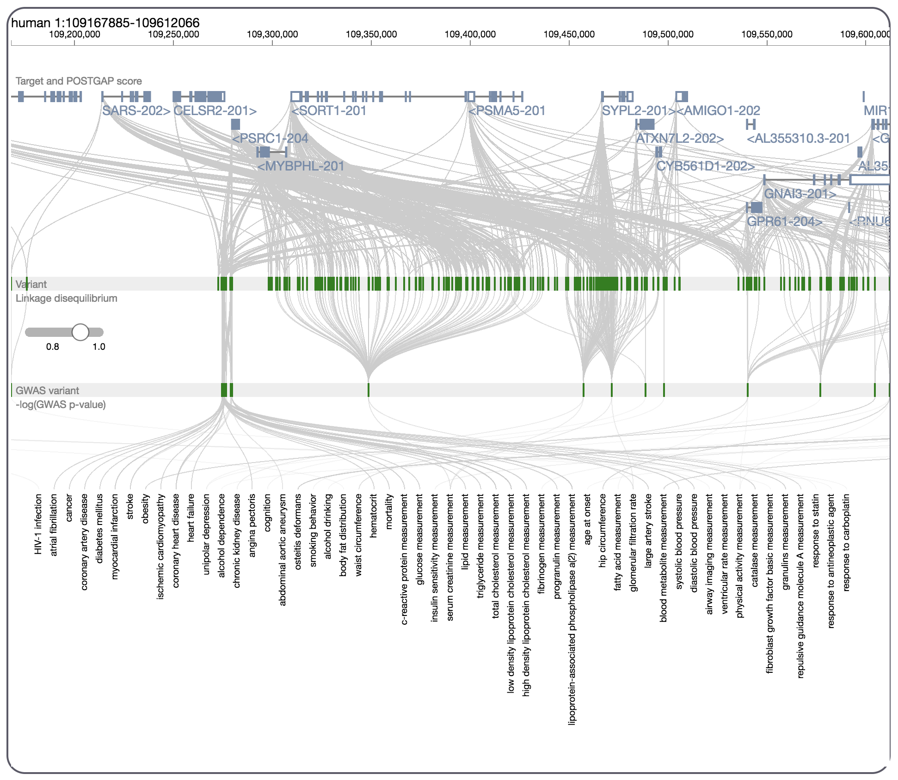
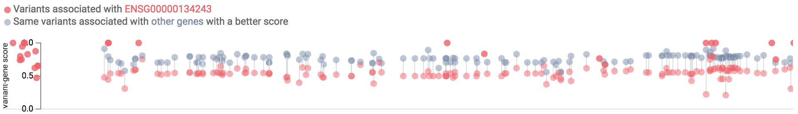
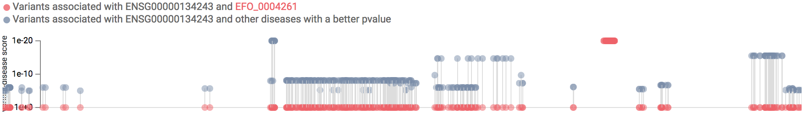
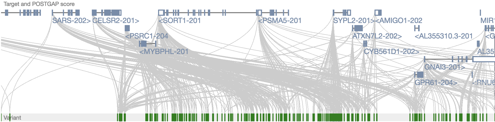
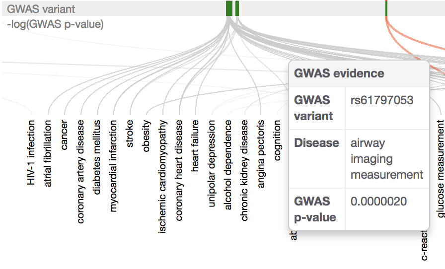
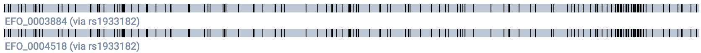
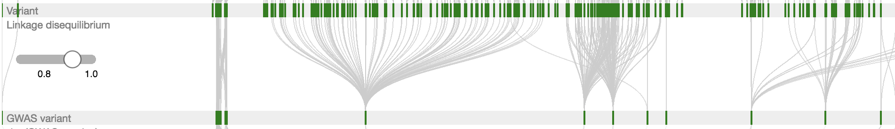

# POSTGAP visualisation

## What can you do in the visualisation?
* Pan and zoom
* Tooltips on mouseover for variants, GWAS variants, diseases, variant-GWAS variant links, GWAS variant-disease links (**not yet** gene, gene-variant links)
* Click a GWAS variant to highlight variant-GWAS variant and GWAS variant-disease links (**not yet** gene-variant links)
* Filter for linkage disequilibrium using a slider

## Justification of changes to previous demo
### Lollipop charts for variant2gene score and GWAS p-value removed:
Before: Multiple circles on lollipop were found to be confusing (eg. corresponding to more than one gene per variant)
* Aggregated variant2gene score

* GWAS p-value

After: Encode eg. the variant2gene score in the weight of the connecting link between the variant and the gene
* Aggregated variant2gene score

* GWAS p-value

### Cluster bar codes removed:
Before: Cluster bar codes showed the variants associated with a disease via a specific GWAS variant (when you clicked a variant)

After: variants in linkage disequilibrium with a GWAS

## Features planned
* Performance improvements - the visualisation is currently very slow - can calls be optimized to Open Targets and Ensembl REST APIs?
* Tooltips on mouseover for:
  * genes (showing basic gene info)
  * gene-variant links (showing all functional genomics subscores and the aggregated variant2gene score)
* Filter for GWAS -log(pvalue) using slider (on GWAS variant-disease links)
* Filter for variant2gene score (which aggregates VEP, GTEx, PCHiC, DHS, Fantom5, Nearest) using slider (on gene-variant links)
* Filter for individual functional genomics scores (VEP, GTEx, PCHiC, DHS, Fantom5, Nearest) using slider or checkbox (on gene-variant links)
* Links out where possible to external sources

## Known bugs
* Render ordering of gene, gene-variant links (genes should always be on top)
* Vertical position of gene-variant links needs to be updated when genes reorder vertically
* Disease names are not correctly distributed on panning or zooming
* General slow performance
* Filtering slider for linkage disequilibrium is temperamental (clicking near the outside triggers whole browser pan/zoom)
